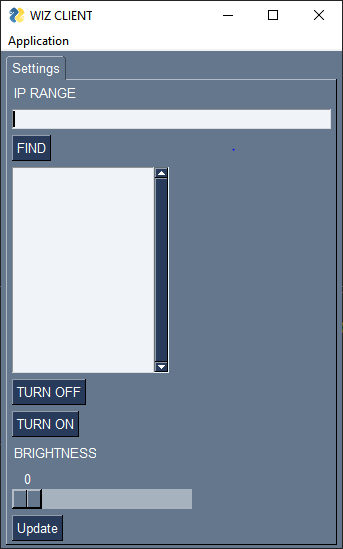
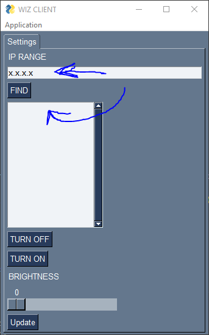

# Philips Wiz Light PC Application

# Overview

This project is a PC version of the Philips Wiz Light control application. The official Philips Wiz Light app is designed for mobile devices, but this project extends the functionality to desktop environments. With this PC application, users can conveniently manage and control their Philips Wiz smart lights directly from their computer.

# Requirements
+ Python 3.10+
+ Additional dependencies pywizlight , pysimplegui


# Acknowledgments

This project is not affiliated with Philips Wiz Light, and it is an independent effort to bring desktop control to Philips Wiz smart lights.
# Installation

Install this software with python

```bash
  git clone https://github.com/ejinbt/wizclient
  cd wizclient
  pip install -r requirements.txt
  python app.py
```
    
## Authors

- [@ejinbt](https://www.github.com/ejinbt)


## Usage/Examples


+ Find your IP range in Wiz mobile app , or type ipconfig on cmd
+ replace last digit by 255 -> x.x.x.255
+ Click FIND to scan for wiz devices on given IP range
+ your devices will appear in list below
+ select one 


## Features

Currently it only features Turning on and off , changing brightness. more features will come soon...
## Screenshots





